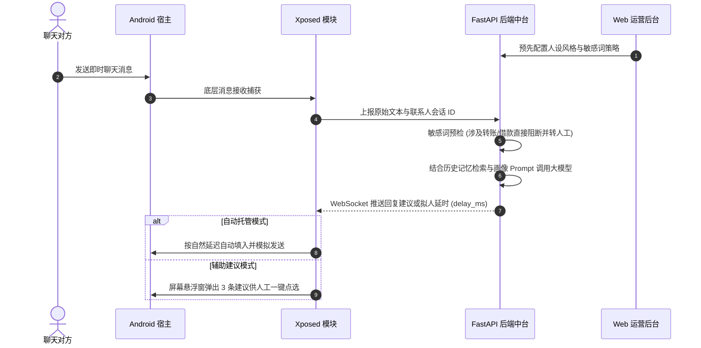

# AI Social Agent (全平台社交智能自动回复系统)

<div align="center">


<p align="center">
  <b>面向现代即时通讯软件的高扩展性全链路 AI 自动应答与运营协同系统</b><br>
  包含「FastAPI 智能风控中台 · React+AntD 运营管理控制台 · Android Xposed 底层无感挂载模块」。
</p>

</div>

---

## 🏗️ 总体系统架构

```
┌──────────────────┐    HTTP REST API + WebSocket    ┌──────────────────────────────────┐
│   Android 端模块  │ ─────────────────────────────▶ │          FastAPI 核心中台         │
│  (LSPosed 挂载点) │ ◀───────────────────────────── │  - JWT 鉴权与卡密生命周期管理     │
└──────────────────┘     智能候选推荐 / 一键熔断广播    │  - 联系人画像与动态人设 Prompt    │
                                                     │  - OpenAI 兼容模型网关 (支持Mock) │
┌──────────────────┐                                 │  - 拟人化延迟调度器 (delay_ms)    │
│   Web 运营控制台  │ ───────────────────────────────┘  - 敏感词合规过滤 (Half转人工)    │
│  (React 18+AntD) │   全局运营：人设 / 卡密 / 审计看板 └──────────────────────────────────┘
└──────────────────┘
```

### 子系统模块职责划分

- **`backend/` (服务核心)**：
  - 基于 Python 3.12 + FastAPI + SQLAlchemy 构建；
  - 完善的 JWT 权限隔离与卡密授权体系（支持服务端一键吊销即触发 Kill Switch）；
  - 联系人画像标签系统（关系深度、语言风格偏好、禁忌避讳话题）；
  - 动态 OpenAI 模型网关（未配置 Key 时自动平滑降级至 mock 建议，便于无额度联调）；
  - 敏感词风控拦截（涉财、验证码等敏感行为自动终止机器回复并转人工）；
  - WebSocket 全双工实时通信中继与审计日志留痕。
- **`admin-web/` (运营工作台)**：
  - 基于 React 18 + Vite 5 + TypeScript + Ant Design 5；
  - 数据可视化仪表盘、联系人画像配置、多角色人设 Prompt 调试、卡密批量生成/冻结、完整审计操作回溯。
- **`android/` (端侧挂载引擎)**：
  - 基于 Kotlin + Xposed / LSPosed 架构体系；
  - 包含 `api/`（中台通信客户端）、`data/`（持久化与卡密缓存）、`hook/`（底层消息拦截与智能回复注入引擎）、`net/`（WebSocket 实时建议接收与熔断感知）、`ui/`（原生配置界面）。

---

## 🚀 快速上手与运行

### 1. 启动后端中台 (Python 3.12+)

```bash
cd backend

# 安装运行依赖
pip install -r requirements.txt

# 启动 Uvicorn 异步服务
uvicorn app.main:app --host 0.0.0.0 --port 8000
```
> [!NOTE]
> 初次启动将自动建表并生成默认管理员凭据：`admin / admin123456`（请在上线后立即通过面板修改）。未配置 `OPENAI_API_KEY` 时默认提供 mock 建议以供链路自测。

### 2. 启动 Web 运营工作台

```bash
cd admin-web

# 安装依赖
npm install

# 启动本地开发热更新服务器 (默认端口 5173，自动反代 /api 到 8000 端口)
npm run dev

# 生产环境静态打包构建
npm run build
```

### 3. 构建与部署 Android 模块

```bash
cd android

# 使用 Gradle 编译 Debug APK
./gradlew :app:assembleDebug
```
1. 编译完成后在目标设备安装生成的 APK；
2. 在 **LSPosed** 框架中启用本模块，勾选宿主应用作用域；
3. 打开配置面板：填入后端服务器 IP 地址（模拟器请填 `10.0.2.2`）、管理员生成的卡密与凭证即可激活。

---

## 🔄 核心业务流转链路



---

## 🧪 自动化测试与工程验证状态

| 模块名称 | 验证方式 | 状态 | 备注说明 |
|:---|:---|:---|:---|
| **backend** | `pytest` 自动化单元测试 | ✅ **19 项全通过** | 包含 `smoke_test.py` 全新库端到端冒烟测试 |
| **admin-web** | `tsc` 静态类型检查 + `vite build` | ✅ **通过** | 静态构建产物产出于 `dist/` |
| **android** | 代码骨架与接口实现 | ⚠️ **源码结构完备** | 核心 Hook 签名需结合实际逆向特征对齐 |

---

## 📚 详细设计文档

- 完整接口 API 协议定义：参阅 [docs/API_CONTRACT.md](docs/API_CONTRACT.md)
- 逆向参考架构：参阅 `客户专用审查/apk_fix_source_code.md`

---

## ⚖️ 免责与合规声明

> [!WARNING]
> 本工程仅供**技术研究、架构学习与合规自动化运营场景**使用。源码不包含任何规避平台安全风控的对抗逻辑。严禁用于电信诈骗、恶意骚扰、非法引流等违法违规用途，使用者因违规操作产生的一切法律责任由其自行承担。
